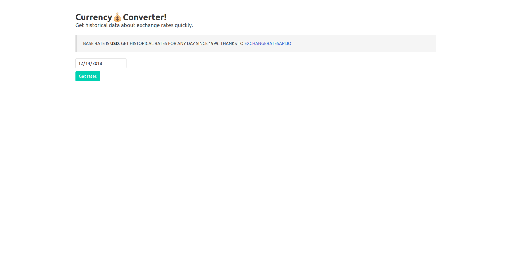
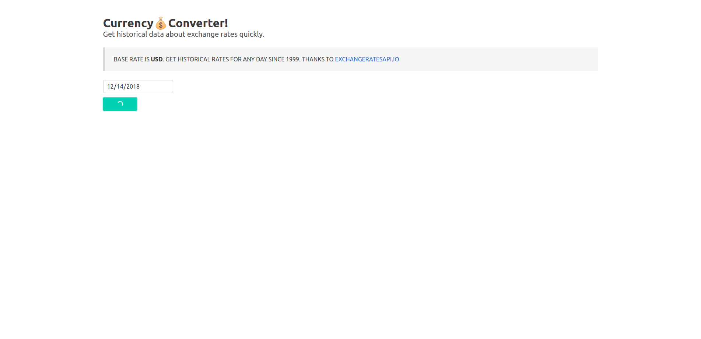

## Super fast web application in nodejs using redis cache

When trying to optimise our applications, one of the first things we look to is caching. Caching involves storing data in a high performance store (many times temporarily) so such data can be retrieved faster at a later time. Redis is an efficient key-value data store that has become very popular for caching. One of the things that makes Redis a good choice is the number of data structures it supports — such as strings, hashes, lists, sets, and so on. This gives us some flexibility!

<!-- docker run --name redis -p 6379:6379 -d redis  -->

## What we have done here? 
- Built a Node.js app from scratch,
- Provisioned a Redis server using the Manifold RedisGreen service,
- Connected to the Redis server, and
- Saved data to, and retrieved data from the Redis store using the node redis client.

## Quick start 
- Assumed you have 8 >= Node.js and Redis installed
- Run redis server (If not then run `docker run --name redis -p 6379:6379 -d redis`)
- Now clone the repository `https://github.com/shamrat17/node-app-with-redis-cache.git`
- Hit `cd node-app-with-redis-cache`
- Install all dependency `npm install`
- Start server `npm start`

## See the magic
Open you browser and go `localhost:5000` you might see somethings like

Now select date and press `Get rates` button. You will see it takes some moments to get the result from server

After getting response hit again `Get rates` button and watch how faster it retrives 

Helper link [here](https://blog.manifold.co/build-super-fast-apps-in-node-js-using-redis-cache-d3d55bbdc375)

